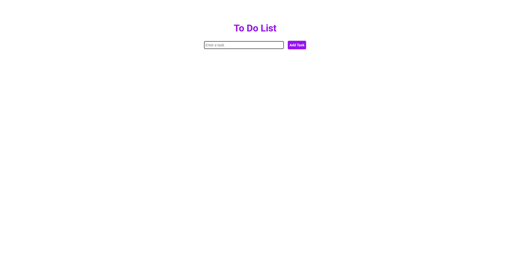
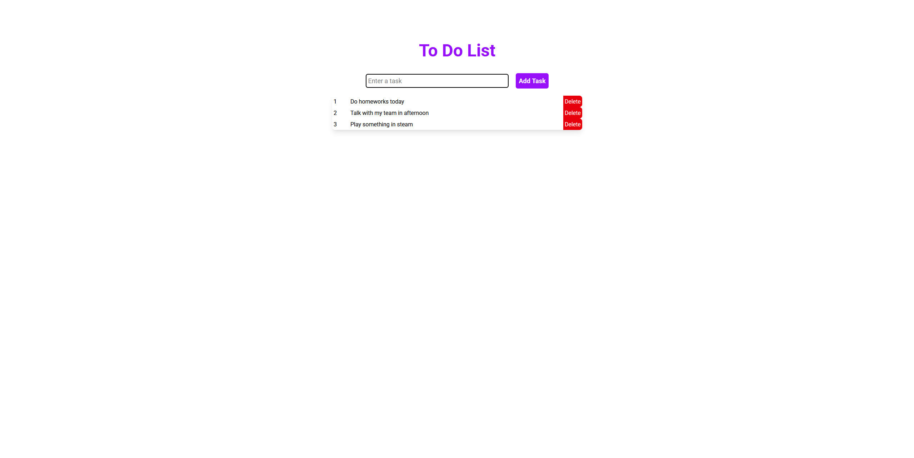

## To-Do List Application

This project is a simple **To-Do List** application built using the following technologies:

## Libraries and Frameworks Used

- **React**: A JavaScript library for building user interfaces.
- **Vite**: A fast build tool and development server for modern web projects.
- **Tailwind CSS**: A utility-first CSS framework for styling.
- **React Hooks**: Used for state management (`useState`).

## Features

- Add and delete tasks dynamically.
- Styled with Tailwind CSS for a modern and responsive design.
- Built with React and Vite for fast development and performance.

## How to Download and Run the Program

Follow these steps to download and run the application locally:

1. **Clone the Repository**:
   ```bash
   git clone <repository-url>
2. **Navigate to the Project Directory**:
   ```bash
   cd <project-directory>
   ```
3. **Install Dependencies**:
   ```bash
   npm install
   ```
4. **Start the Development Server**:
   ```bash
    npm run dev
    ```
## Screenshots



